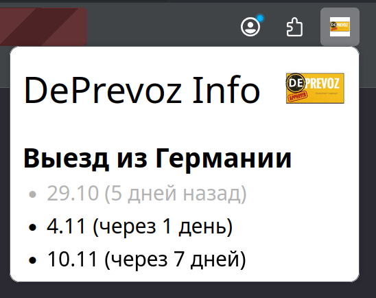
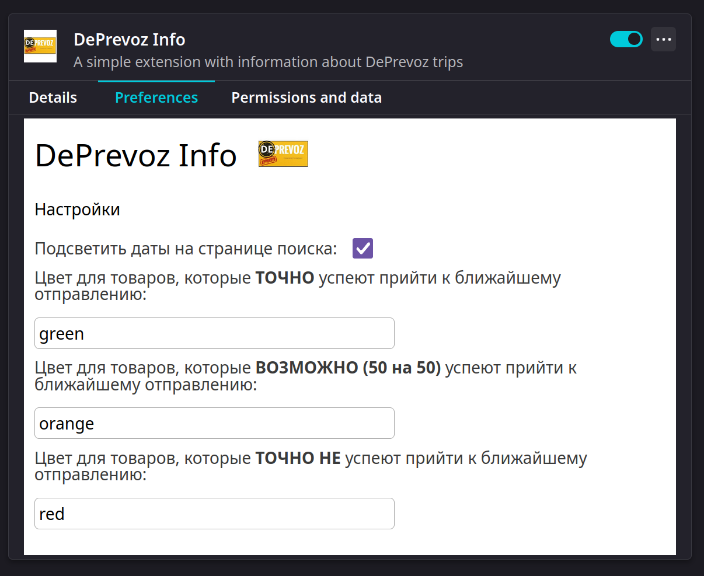
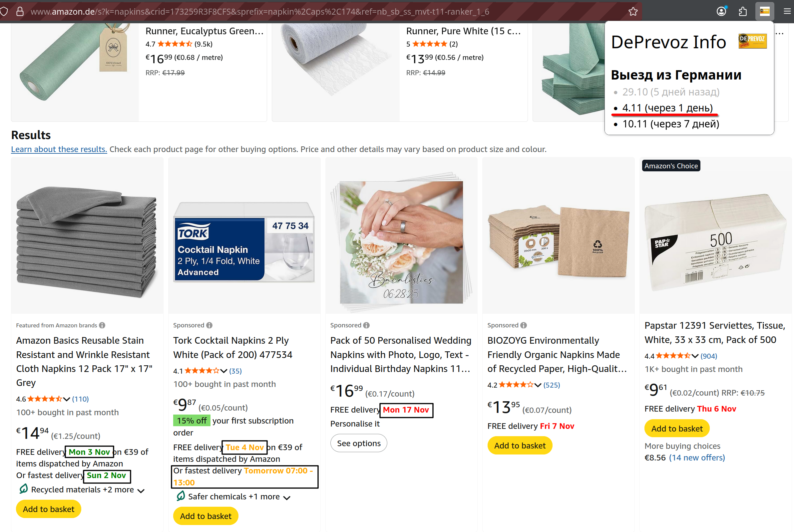

# Deprevoz Info

[Firefox extension](https://addons.mozilla.org/en-US/firefox/extensions/) for displaying departure dates of [DePrevoz](https://deprevoz.com/) written with [Angular](https://angular.dev/).

### How it looks like

*Whole UI is written in Russian language.*

In popup you can see all departure dates from [DePrevoz page](https://deprevoz.com/datumi-polaska-html/). The past dates are colored gray.



In options page you can toggle checkbox for highlighting dates on the [Amazon.de search page](https://www.amazon.de/s?k=). There are also 3 color settings:

- goods that **will definitely** arrive on time
- goods that are **possible** (50/50) to arrive on time
- goods that **will not** arrive on time

All dates from the search page are compared with <ins>the closest departure date<ins>.





*Dates on screenshot are not real, they are shown only as an example.*

> Before using the search page functionality, make sure you opened the popup at least once. The popup page is where the departure dates data is saved, which is then used on the search page.

NOTE: Sometimes during pagination the colors may not be applied, to make this happen just open the popup.

### Run as SPA in browser

```bash
npm ci
npm run start:web
```

### Run as extension

```bash
npm ci
npm run start:extension
```

### Build as extension

```bash
npm ci
npm run assembly:extension
```

[Install](https://developer.mozilla.org/en-US/docs/Mozilla/Add-ons/WebExtensions/Your_first_WebExtension#installing) as custom extension using path `./dist/deprevoz-info/browser`.

### References

- https://habr.com/ru/articles/851234/
- https://habr.com/ru/articles/858078/

### CHANGELOG

#### [1.0.0] - 19.10.2025

### Added

- Getting information about dates from [DePrevoz page](https://deprevoz.com/datumi-polaska-html/)
- Displaying list of dates
- MIT License

#### [2.0.0] - 03.11.2025

### Added

- Highlighting dates on [Amazon.de search page](https://www.amazon.de/s?k=) depending on whether they will arrive in time for the closest departure date of DePrevoz
- Setting for colors in options page
- Section 'How it looks like' to README.md
